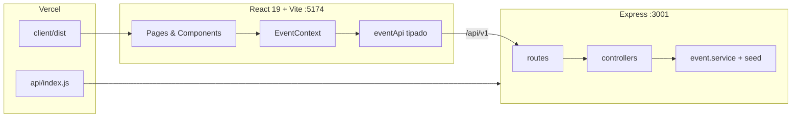

<div align="center">

# 💗 ONCE Countdown

### Tu panel fan para no perderte ni una fecha de TWICE

**World Tour «THIS IS FOR» (2026)** · comebacks · MVs · fanmeets — todo en un solo hub con cuenta atrás en vivo.

<br />

[](https://react.dev/)
[](https://www.typescriptlang.org/)
[](https://tailwindcss.com/)
[](https://expressjs.com/)
[](https://vercel.com/)

<br />

**[Demo local](http://localhost:5174)** · **[Repositorio](https://github.com/BluX-Myoui/Once-Countdown)**

<br />

   

> ⚠️ Proyecto fan **no oficial**. Sin afiliación a JYP Entertainment ni a TWICE. Uso académico de nombres y estética del tour — sin logos ni assets con copyright de JYP.

</div>

---

## ✨ ¿Qué es ONCE Countdown?

**ONCE Countdown** es un hub web para fans (ONCE) que centraliza fechas del world tour **THIS IS FOR**, comebacks, estrenos de MV y eventos personales, con:

- ⏱️ **Cuenta atrás en tiempo real** al evento destacado (días, horas, minutos, segundos).
- 🌍 **44 paradas del World Tour** precargadas (Asia/Oceanía 2025 + Norteamérica, Taipei, Tokyo Stadium y Europa 2026).
- 🔍 **Buscador inteligente**: escribe «España» y las coincidencias **suben arriba** sin ocultar el resto.
- 📅 **Calendario y selects personalizados** con la paleta del tour (no el gris aburrido del sistema).
- ⚡ **Destacar eventos sin recargar la página** — actualización optimista, cero «mini F5».

Inspirado en la energía del tour **THIS IS FOR**, con UI glassmorphism, orbes animados y tipografía **Syne + Outfit**.

---

## 🖼️ Vista rápida

| Inicio | Eventos |
|--------|---------|
| Countdown hero al evento destacado + stats del tour | Listado, filtros, buscador, CRUD y formulario por pestañas |

> Tras clonar el repo y arrancar en local, abre **http://localhost:5174** para ver la UI completa.

---

## 🚀 Arranque en 60 segundos

### Requisitos

- [Node.js](https://nodejs.org/) **≥ 18** (LTS 20+ recomendado)
- npm **9+**

### 1️⃣ Clonar

```bash
git clone https://github.com/BluX-Myoui/Once-Countdown.git
cd Once-Countdown
```

### 2️⃣ Terminal A — API (`3001`)

```bash
cd server
npm install
npm run dev
```

✅ Debe aparecer: `ONCE Countdown API → http://localhost:3001`

### 3️⃣ Terminal B — Frontend (`5174`)

```bash
cd client
npm install
npm run dev
```

### 4️⃣ Abrir

👉 **http://localhost:5174**

> En desarrollo, Vite hace proxy de `/api` → `localhost:3001`. Usa **5174** para la app; el 3001 solo es la API.

<details>
<summary><strong>Windows: si <code>npm</code> no se reconoce</strong></summary>

```powershell
$env:Path = "C:\Program Files\nodejs;" + $env:Path
```

O reinicia Cursor (el repo incluye `.vscode/settings.json` con el PATH de Node).

</details>

### Scripts desde la raíz

```bash
npm run dev:server   # API
npm run dev:client   # Frontend
npm run build        # Build → client/dist
```

---

## 🎯 Funcionalidades destacadas

### ⏳ Countdown en vivo

El hero de la home muestra el evento **destacado** con dígitos que hacen «tick» cada segundo. Por defecto apunta a la **próxima parada** del tour (orden automático por fecha).

### 🌐 World Tour THIS IS FOR — 44 ciudades

Seed completo basado en el calendario del tour ([referencia Wikipedia](https://en.wikipedia.org/wiki/This_Is_For_World_Tour)):

| Región | Ejemplos |
|--------|----------|
| 2025 | Incheon, Osaka, Tokyo Dome, Macau, Bulacan, Singapore, KL, Sydney, Melbourne, Kaohsiung, Hong Kong, Bangkok… |
| 2026 | Vancouver → Austin (NA) · Taipei · Tokyo National Stadium · Lisboa → **Londres** (cierre) |

Los eventos oficiales del **World Tour 2026** en seed **no se pueden borrar** (protección en cliente y API `403`).

### 🔎 Buscador estilo «sube al top»

- Escribe `espana`, `berlin`, `comeback`…
- Las coincidencias **se reordenan al inicio** y se resaltan.
- **Ninguna tarjeta desaparece** — al borrar la búsqueda, vuelve el orden por «próximo en celebrarse».

### 📋 Calendario ONCE (`/eventos`)

- Filtros: Todos · World Tour · Comeback · MV · Fanmeet
- Lista con **4 tarjetas visibles** sin recorte + scroll
- Orden: **próximo evento primero**, pasados al final
- Formulario **Nuevo evento** en 3 pestañas: *Evento → Lugar y fecha → Notas*
- `OnceSelect` y `OnceDateTimePicker` con tema rosa/dorado

### 🛡️ UX pulida

- Destacar / borrar / crear **sin pantallazo de carga**
- Hover en tarjetas: solo borde suave (sin que «salten»)
- Badges por tipo de evento con colores del tour

---

## 🏗️ Arquitectura



| Capa | Tecnología |
|------|------------|
| Frontend | React 19, TypeScript, Tailwind CSS 4, React Router 7 |
| Estado | Context API + hooks (`useCountdown`) |
| Backend | Node.js, Express, arquitectura routes → controllers → services |
| Datos | Memoria + seed en `server/src/data/this-is-for-seed.js` |
| Deploy | Vercel (`vercel.json`: SPA + serverless API) |

---

## 📁 Estructura del repo

```
Once-Countdown/
├── client/                 # Frontend (Vite, puerto 5174)
│   └── src/
│       ├── api/            # Cliente REST tipado
│       ├── components/     # Layout, CountdownHero, EventCard, EventForm,
│       │                   # EventSearchBar, OnceSelect, OnceDateTimePicker
│       ├── context/        # EventContext
│       ├── hooks/          # useCountdown
│       ├── pages/          # Home, Eventos, Acerca, 404
│       └── utils/          # search, sort, labels, eventRules
├── server/                 # API Express (puerto 3001)
│   └── src/
│       ├── data/           # Seed THIS IS FOR (44 ciudades + extras)
│       ├── routes/
│       ├── controllers/
│       └── services/
├── api/                    # Handler Vercel → Express
├── docs/                   # Idea, diseño, agile, API, deploy, retrospectiva
├── vercel.json
└── .vscode/                # PATH Node en terminales Cursor/VS Code
```

---

## 🔌 API REST

Base: `/api/v1`

| Método | Ruta | Descripción |
|--------|------|-------------|
| `GET` | `/health` | `{ status: "ok", service: "ONCE Countdown API" }` |
| `GET` | `/events` | Listar (`?type=`, `?tourName=`, `?upcoming=true`) |
| `GET` | `/events/featured` | Evento destacado (home) |
| `GET` | `/events/meta` | Tipos y nombres de tour |
| `GET` | `/events/:id` | Detalle |
| `POST` | `/events` | Crear evento |
| `PATCH` | `/events/:id` | Actualizar / destacar |
| `DELETE` | `/events/:id` | Borrar *(403 si es WT 2026 oficial)* |

Documentación del cliente: [`docs/api-client.md`](docs/api-client.md).

---

## 🎨 Paleta THIS IS FOR 2026

| Token | Hex | Uso |
|-------|-----|-----|
| Pink | `#ff2d7a` | Primario, CTAs, acentos |
| Hot | `#ff5cab` | Gradientes |
| Magenta | `#b8145c` | Orbes de fondo |
| Glow | `#ff9ec8` | Texto destacado |
| Gold | `#f0c14a` | Tour, chips, subtítulos |
| Dark | `#0c0610` | Fondo |
| Panel | `#1a0f1f` | Glass panels |
| Cream | `#fff0f6` | Texto principal |

**Fuentes:** [Syne](https://fonts.google.com/specimen/Syne) (display) · [Outfit](https://fonts.google.com/specimen/Outfit) (UI)

---

## ☁️ Deploy en Vercel

1. Fork o importa **[BluX-Myoui/Once-Countdown](https://github.com/BluX-Myoui/Once-Countdown)** en [Vercel](https://vercel.com).
2. El `vercel.json` ya configura build + API serverless.
3. Comprueba tras el deploy:
   - `/` — UI
   - `/api/v1/health` — health check
   - `/eventos` — CRUD

Guía paso a paso: [`docs/deployment.md`](docs/deployment.md).

> Los datos están **en memoria**. Un cold start en Vercel puede reiniciar el seed (comportamiento esperado en demo).

---

## 📚 Documentación

| Doc | Contenido |
|-----|-----------|
| [`docs/idea.md`](docs/idea.md) | Problema, público, funcionalidades |
| [`docs/design.md`](docs/design.md) | Arquitectura y flujo |
| [`docs/agile.md`](docs/agile.md) | Kanban / Scrum |
| [`docs/project-management.md`](docs/project-management.md) | Trello |
| [`docs/api-client.md`](docs/api-client.md) | Cliente API |
| [`docs/deployment.md`](docs/deployment.md) | Vercel |
| [`docs/retrospective.md`](docs/retrospective.md) | Retrospectiva |

---

## 🧪 Comandos útiles

```bash
# Build de producción (client)
cd client && npm run build

# Preview del build
cd client && npm run preview

# Health check (con API levantada)
curl http://localhost:3001/api/v1/health
```

---

<div align="center">

**¿Eres ONCE?** Clona el repo, levanta las dos terminales y no te pierdas la próxima parada del tour.

💗 *THIS IS FOR — World Tour Hub*

</div>
